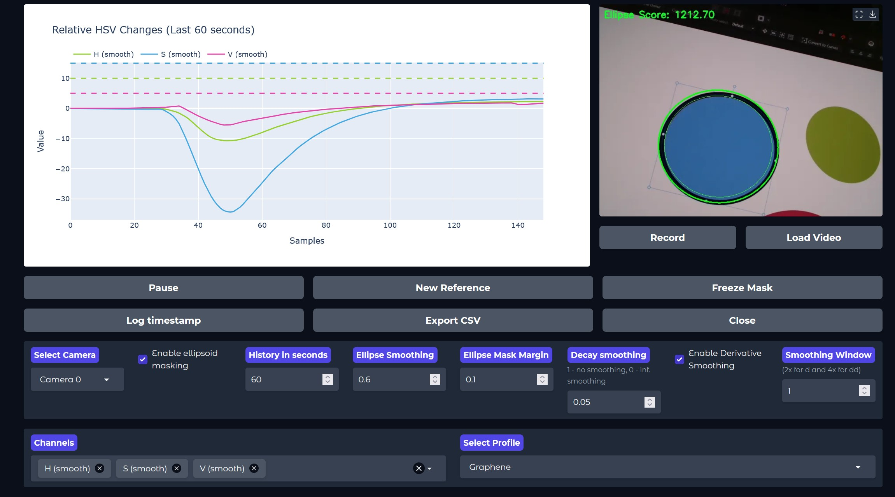

# Automated Langmuir Deposition Detection

## Overview 

This project aims to create an easy to use interface for monitoring and controlling the injection process of ink onto a liquid surface and to turn off the injection once the saturation point is reached. The idea is to observe relative HSV time series data (hue, saturation, brightness/value) to find the point of saturation. The reference frame should be captured before the injection starts.

The interface consists of a webserver that currently performs the following tasks:
- capture a real-time webcam or Raspberry Pi camera feed
- perform edge detection and temporarily stable ellipse fitting to find the region of interest: in our case this is a cylindrical container
- capture a reference frame and calculate the relative HSV data for each subsequently captured frame (and their first and second derivatives
- select which of the captured and calculated timeseries to plot in a user defined range
- load a CSV file with sparse threshold profiles. If all threshold conditions are met, alert the user visually

> [!Important]
> Manual exposure and white balance values were only tested on a Raspberry Pi Ubuntu system with a Logitech C920. Other devices are currently not supported for manual exposure control.

> [!Note]
> **This is a work in progress. There will be bugs. Some things will not work as intended. Feel free to poke around in the code and submit a PR if you want to help fix things.**

*Screenshot of the Gradio-based Web UI.*

## Installation on a desktop computer/laptop

1. Clone this project with `git clone https://github.com/smlpt/deposition-detection`
2. Ensure that a webcam is connected to your computer
3. On Windows: launch `launch_server_windows.bat` to launch the server. This will also automatically set up a virtual environment with the required packages on first launch.
On Linux, make the shell script executable by running `chmod +x run_project.sh` and then launch `./launch_server_linux.sh`.
4. Open `http://localhost:7860/` in a browser to access the interface
5. To stop the server, hit the "close" button in the GUI, or press Ctrl+C in the console.

## Installation on a Raspberry Pi

1. Clone this project with `git clone https://github.com/smlpt/deposition-detection`
2. Ensure that either a webcam or the Raspberry Pi camera is connected to your Raspberry Pi
3. Make the shell script executable by running `chmod +x run_project.sh` and then launch `./launch_server_linux.sh`. This will also automatically set up a virtual environment with the required packages on first launch.
4. Open `http://<raspberry-pi-ip>:7860` in a browser to access the interface. To find the IP address of the Raspberry Pi, you either have to go looking in your Router, or you connect a display and a keyboard and find the IP via `ifconfig`.
5. To stop the server, hit the "close" button in the GUI, or press Ctrl+C in the console.

## Changelog

### v0.3 Thresholds
- Adds a profile.csv file to load sparse threshold data for different materials (filled with dummy data right now)
- Plot thresholds with the corresponding timeseries
- Monitor threshold conditions and alert the user when all conditions are met
- Adds an inner ellipse 90% the size of the original ellipse. This inner ellipse is used for calculations to prevent minor pixel shifts/errors around the mask contour
- Adds a log button that outputs the values of the current timestamp for all existing timeseries

### v0.2 Stable Masking and Derivatives
- Masks are now temporarily stable by adding the distance to the previous detection to the score function
- Masks transition smoothly between frames
- Calculate first and second derivatives of each H/S/V channel
- Dropdown to select which channels to plot

### v0.1 Initial release
- Real-time webcam capturing
- Edge detection and basic ellipse fitting
- HSV plotting for relative changes
- Export to CSV
- Manual exposure/WB settings
